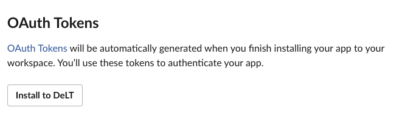
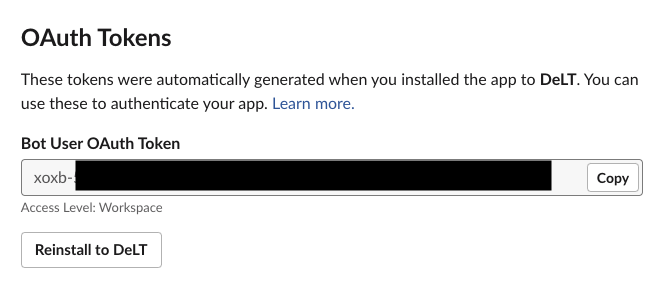
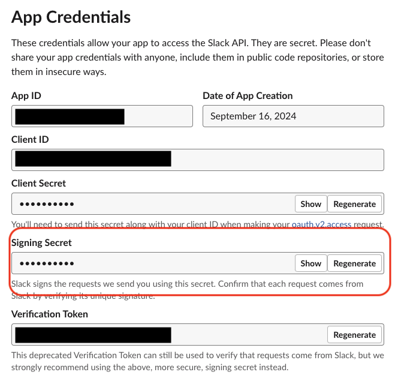

# SlackAiBot

## ryeのインストール for mac
```
curl -sSf https://rye-up.com/get | bash
echo 'source "$HOME/.rye/env"' >> ~/.zshrc
source ~/.zshrc
```

## プロジェクトの環境構築
```
rye sync
```

## .envrcの設定
```
cp .envrc.example .envrc
```

## フォーマット
```
rye run format
```

# セットアップ方法

## Slack側の設定

### アプリの作成
https://api.slack.com/apps?new_app=1

`Create New App` を選択


`From scratch` を選択


App Nameとworkspaceを入力


### アプリの設定

アプリが作成できたら `OAuth & Permissions` のページから `Scopes` に以下を設定

- app_mentions:read
- chat:write
- groups:read


### Workspaceにインストール

`Install to <Workspace名>` でインストール



## コード側の設定

二つの環境変数を設定する
- SLACK_BOT_TOKEN
- SLACK_SIGNING_SECRET

#### SLACK_BOT_TOKEN

OAuth & Permissions



#### SLACK_SIGNING_SECRET

Basic Information


